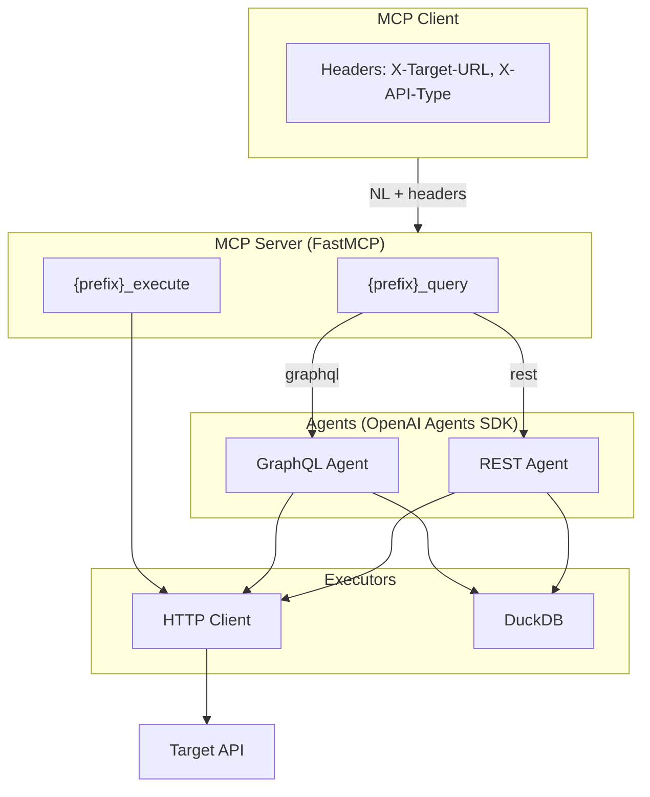
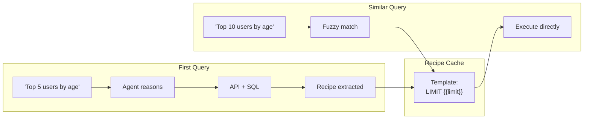

# API Agent

**Turn any API into an MCP server. Query in English. Get results—even when the API can't.**

Point at any GraphQL or REST API. Ask questions in natural language. The agent fetches data, stores it in DuckDB, and runs SQL post-processing. Rankings, filters, JOINs work **even if the API doesn't support them**.

## What Makes It Different

**🎯 Zero config.** No custom MCP code per API. Point at a GraphQL endpoint or OpenAPI spec—agent introspects schema automatically.

**✨ SQL post-processing.** API returns 10,000 unsorted rows? Agent ranks top 10. No GROUP BY? Agent aggregates. Need JOINs across endpoints? Agent combines. The API doesn't need to support it—the agent does.

**🔒 Safe by default.** Read-only. Mutations blocked unless explicitly allowed.

**🧠 Recipe learning.** Agent learns from successful queries. Ask once, reuse cached pipelines execute instantly without LLM reasoning.

## Quick Start

**1. Run (choose one):**

```bash
# Direct run (no clone needed)
OPENAI_API_KEY=your_key uvx --from git+https://github.com/agoda-com/api-agent api-agent

# Or clone & run
git clone https://github.com/agoda-com/api-agent.git && cd api-agent
uv sync && OPENAI_API_KEY=your_key uv run api-agent

# Or Docker
git clone https://github.com/agoda-com/api-agent
docker build -t api-agent .
docker run -p 3000:3000 -e OPENAI_API_KEY=your_key api-agent
```

**2. Add to any MCP client:**
```json
{
  "mcpServers": {
    "rickandmorty": {
      "url": "http://localhost:3000/mcp",
      "headers": {
        "X-Target-URL": "https://rickandmortyapi.com/graphql",
        "X-API-Type": "graphql"
      }
    }
  }
}
```

**3. Ask questions:**
- *"Show characters from Earth, only alive ones, group by species"*
- *"Top 10 characters by episode count"*
- *"Compare alive vs dead by species, only species with 10+ characters"*

That's it. Agent introspects schema, generates queries, runs SQL post-processing.

## More Examples

**REST API (Petstore):**
```json
{
  "mcpServers": {
    "petstore": {
      "url": "http://localhost:3000/mcp",
      "headers": {
        "X-Target-URL": "https://petstore3.swagger.io/api/v3/openapi.json",
        "X-API-Type": "rest"
      }
    }
  }
}
```

**Your own API with auth:**
```json
{
  "mcpServers": {
    "myapi": {
      "url": "http://localhost:3000/mcp",
      "headers": {
        "X-Target-URL": "https://api.example.com/graphql",
        "X-API-Type": "graphql",
        "X-Target-Headers": "{\"Authorization\": \"Bearer YOUR_TOKEN\"}"
      }
    }
  }
}
```

---

## Reference

### Headers

| Header                 | Required | Description                                                |
| ---------------------- | -------- | ---------------------------------------------------------- |
| `X-Target-URL`         | Yes      | GraphQL endpoint OR OpenAPI spec URL                       |
| `X-API-Type`           | Yes      | `graphql` or `rest`                                        |
| `X-Target-Headers`     | No       | JSON auth headers, e.g. `{"Authorization": "Bearer xxx"}`  |
| `X-API-Name`           | No       | Override tool name prefix (default: auto-generated)        |
| `X-Base-URL`           | No       | Override base URL for REST API calls                       |
| `X-Allow-Unsafe-Paths` | No       | JSON array of glob patterns for POST/PUT/DELETE/PATCH      |
| `X-Poll-Paths`         | No       | JSON array of paths requiring polling (enables poll tool)  |
| `X-Include-Result`     | No       | Include full uncapped `result` field in output             |

### MCP Tools

2 tools exposed per API:

| Tool               | Input                                                          | Output                          |
| ------------------ | -------------------------------------------------------------- | ------------------------------- |
| `{prefix}_query`   | Natural language question                                      | `{ok, data, queries/api_calls}` |
| `{prefix}_execute` | GraphQL: `query`, `variables` / REST: `method`, `path`, params | `{ok, data}`                    |

Tool names auto-generated from URL (e.g., `example_query`). Override with `X-API-Name`.

### Configuration

| Variable                      | Required | Default                   | Description                        |
| ----------------------------- | -------- | ------------------------- | ---------------------------------- |
| `OPENAI_API_KEY`              | **Yes**  | -                         | OpenAI API key (or custom LLM key) |
| `OPENAI_BASE_URL`             | No       | https://api.openai.com/v1 | Custom LLM endpoint                |
| `API_AGENT_MODEL_NAME`        | No       | gpt-5.2                   | Model (e.g., gpt-5.2)              |
| `API_AGENT_PORT`              | No       | 3000                      | Server port                        |
| `API_AGENT_ENABLE_RECIPES`    | No       | true                      | Enable recipe learning & caching   |
| `API_AGENT_RECIPE_CACHE_SIZE` | No       | 64                        | Max cached recipes (LRU eviction)  |
| `OTEL_EXPORTER_OTLP_ENDPOINT` | No       | -                         | OpenTelemetry tracing endpoint     |

---

## How It Works

```mermaid
sequenceDiagram
    participant U as User
    participant M as MCP Server
    participant A as Agent
    participant G as Target API

    U->>M: Question + Headers
    M->>G: Schema introspection
    G-->>M: Schema
    M->>A: Schema + question
    A->>G: API call
    G-->>A: Data → stored in DuckDB
    A->>A: SQL post-processing
    A-->>M: Summary
    M-->>U: {ok, data, queries[]}
```



## Architecture



**Stack:** [FastMCP](https://github.com/jlowin/fastmcp) • [OpenAI Agents SDK](https://openai.github.io/openai-agents-python/) • [DuckDB](https://duckdb.org)

---

## Recipe Learning

Agent automatically learns reusable patterns from successful queries. When you ask a question, the agent:

1. **Executes** - Runs API calls + SQL post-processing via LLM reasoning
2. **Extracts** - LLM converts execution trace into parameterized template
3. **Caches** - Stores recipe keyed by (API, schema hash) with fuzzy question matching
4. **Reuses** - Similar future questions execute cached recipe instantly (no LLM reasoning)



**Recipe structure:**
- **GraphQL**: `query_template` with `{{param}}` placeholders
- **REST**: `path_params`, `query_params`, `body` with `{"$param": "name"}` refs
- **SQL**: `{{param}}` in SQL strings

Recipes auto-expire when schema changes (hash mismatch). Disable with `API_AGENT_ENABLE_RECIPES=false`.

---

## Development

```bash
git clone https://github.com/agoda-com/api-agent.git
cd api-agent
uv sync --group dev
uv run pytest tests/ -v
```

## Observability

OpenTelemetry tracing auto-enabled when `OTEL_EXPORTER_OTLP_ENDPOINT` is set. Works with Jaeger, Zipkin, Grafana Tempo, Arize Phoenix.
